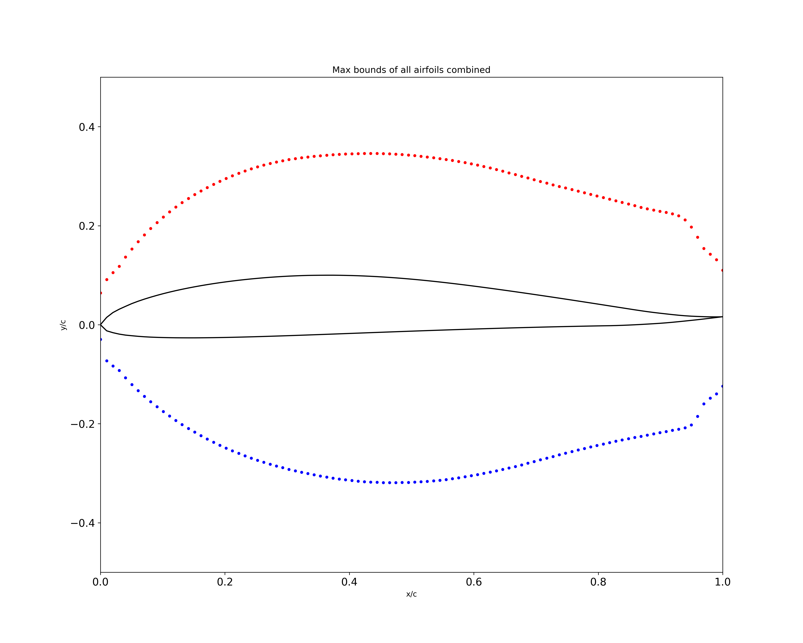
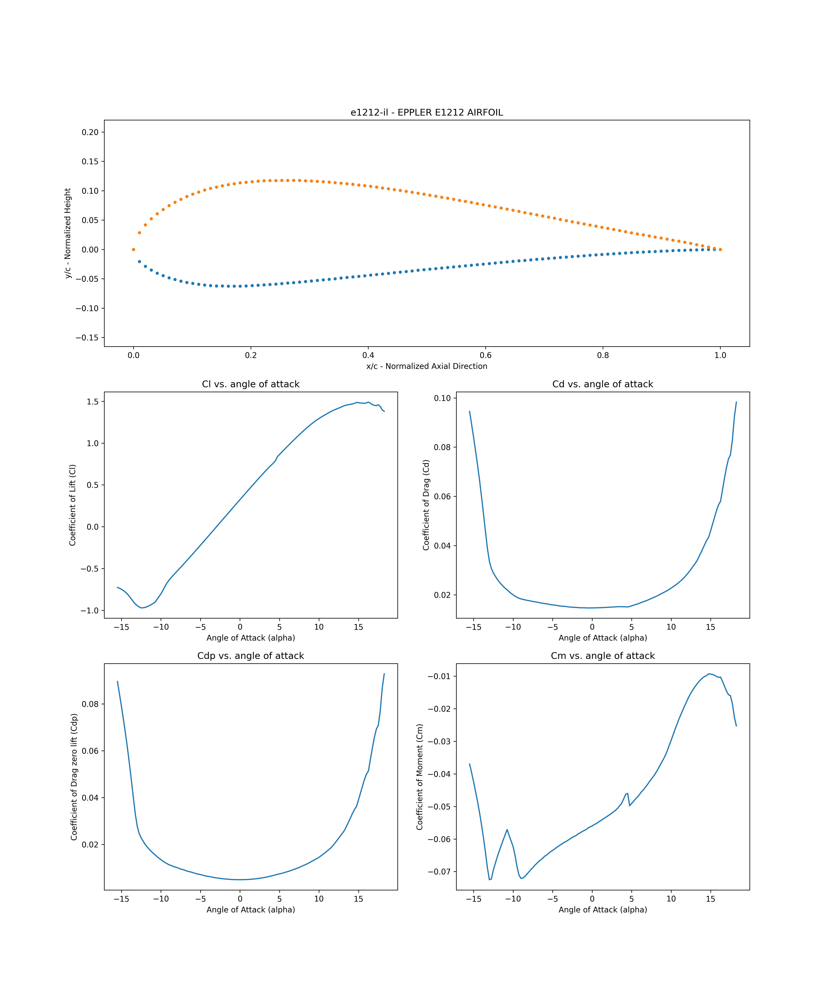

# Generate XFOIL
This folder has files needed to mine the airfoils and data from airfoil-tools.com.

# Installation
pip install -r requirements.txt

## Pytorch and Pytorch Geometric
These are the versions used at the time of testing. It may work with newer versions, if not please fix and submit a pull request or file a github issue. 

- **CPU**: pip3 install torch==1.10.1+cu113 torchvision==0.11.2+cu113 torchaudio===0.10.1+cu113 -f https://download.pytorch.org/whl/cu113/torch_stable.html
- **GPU**: pip3 install torch torchvision torchaudio
- **Cpu version of PyTorch Geometric**: `pip install torch-scatter torch-sparse torch-cluster torch-spline-conv torch-geometric -f https://data.pyg.org/whl/torch-1.10.0+cpu.html`
- **GPU version of PyTorch Geometric**: `pip install torch-scatter torch-sparse torch-cluster torch-spline-conv torch-geometric -f https://data.pyg.org/whl/torch-1.10.0+cu113.html`

# Summary of the files and what they do
## Step1_GatherData.py
This file mines the website airfoil-tools.com and downloads each airfoil to data/scrape folder.

### Requirements
- bs4: Beautiful soup 

---
**NOTE**

This may not work if airfoil-tools changes their website. 

---

## Step2_XfoilScrapedData.py
This file processes the airfoils in data/scrape folder. **This code is intended to be run on ubuntu.** It will loop through each of the files and run the xfoil simulation gathering data on Cl, Cd, Cdp, Cm, and Cp distribution for each angle of attack. The results are then interpolated such that every airfoil has the same number of points for the geometry as well as for the Cp distribution. The `pchip` method is used to interpolate the data. 

The results from Step2_XfoilScrapedData.py are saved to json/ folder. 

## Step3_NormalizeData.py
After processing all the scraped airfoils into json. The data needs to be normalized so that each of the values `alpha`, `Re`, `NCrit` are of the same scale from 0 to 1 for example. Normalizing is done in 2 ways. First method uses `StandardScaler` which normalizes the data with mean and standard deviation. This is probably the most ideal if you think there maybe some extremes such as `Cp` is very high for a particular airfoil at a certain point. The second method is called `minmax` this normalizes all the data between 0 and 1. This method is ideal if you truely know all your data is of a certain range and there are no extremes.

This file creates a scalers.pickle file with all the normization parameters to do either the `StandardScaler` or `minmax`

## Step4_CreateDataset.py
This takes the normalization file `scalers.pickle` and normalizes all the jsons then saves the results to `datasets/` folder. 

### What is inside the datasets folder?
Inside you will see the following
- dnn_scaled_cp_test.pt : Deep Neural Network data format with Cp values for test
- dnn_scaled_cp_train.pt : Deep Neural Network data format with Cp values for train
- dnn_scaled_test.pt : Deep Neural Network data format with only Cl, Cd, Cdp, Cm for test
- dnn_scaled_train.pt : Deep Neural Network data format with only Cl, Cd, Cdp, Cm for train
- graph_scaled_cp_test.pt : Graph Neural Network data format with Cp values for test
- graph_scaled_cp_train.pt : Graph Neural Network data format with Cp values for train
- graph_scaled_test.pt : Graph Neural Network data format with only Cl, Cd, Cdp, Cm for test
- graph_scaled_train.pt : Graph Neural Network data format with only Cl, Cd, Cdp, Cm for train

## view_data.py
This file does 2 things.
1. It reads a all json generated by Step2 and plots is used to plot the max bounds of y/c

2. It picks a random airfoil and plots the results 
